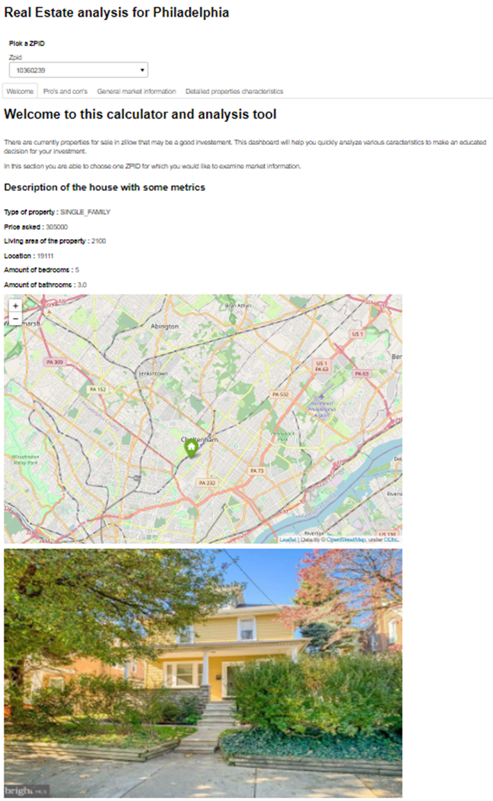
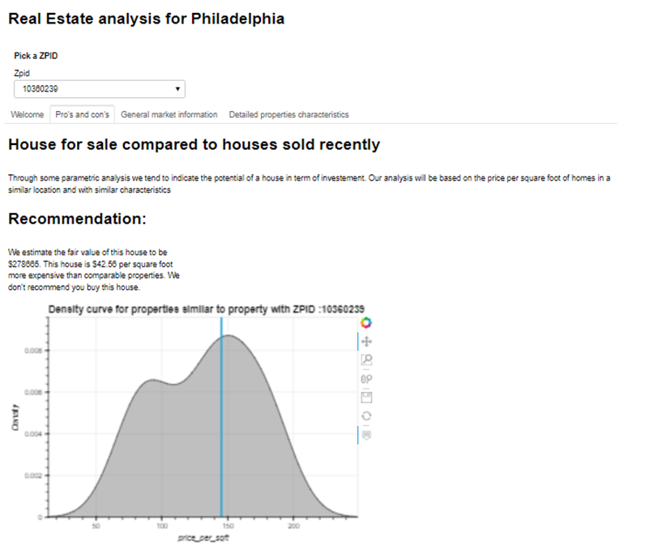
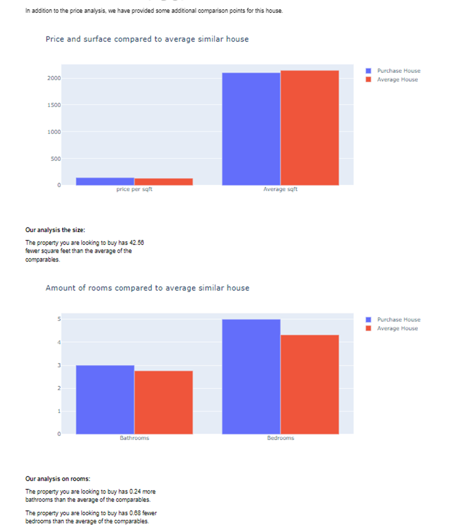
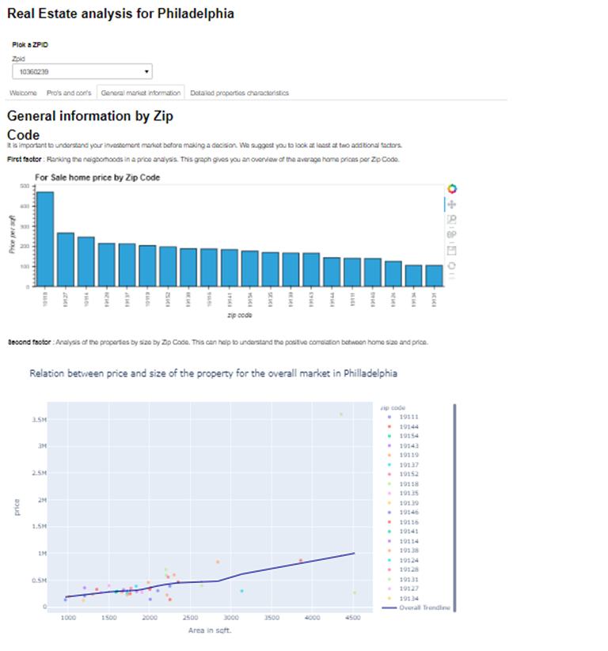
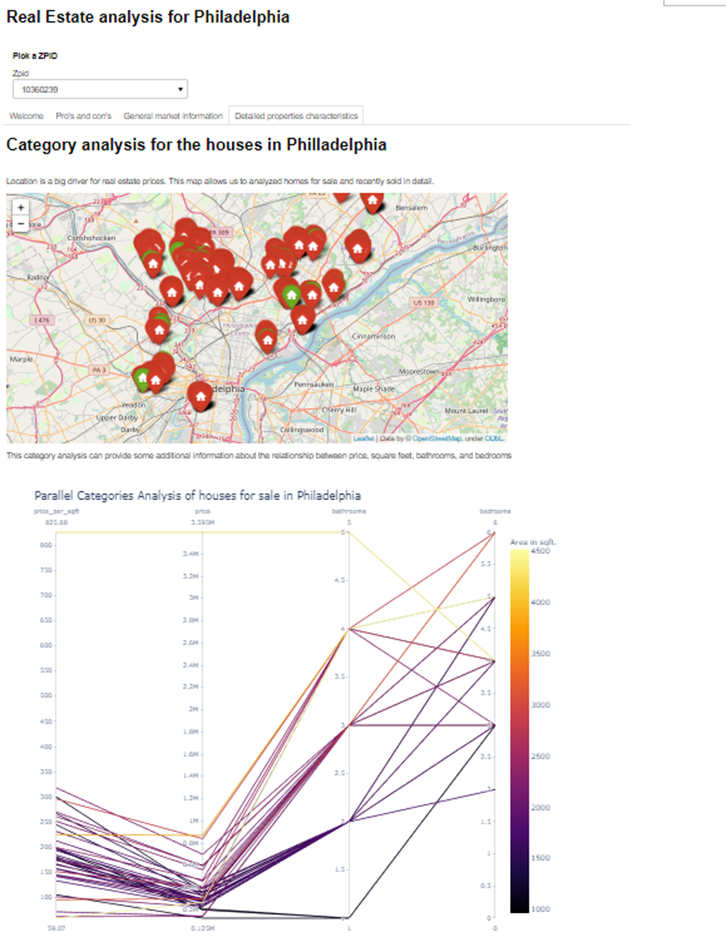

# Team-5-Project-1

##  Real Estate Value Calculator

***
###
**Team Members:**

     Angela Maturo
                   Alex Eakins
                               Jean-Pierre Koudifo
                                                    Sarah Donofrio
                                                                    Thomas Forget
                                                            

***

**Project Description:**

In the past year, the residential real estate market has been highly competitive. With many people looking to buy a home, our team decided to build a calculator to determine the fair market value of a house for sale based on comparable sales. The calculator will take into account the price per square foot of a home and compare it to the average price per square foot of the comparables and provide a "buy" or "not buy" recommendation. It will also provide the buyer information on the comparable homes square footage, average bedrooms, and average bathrooms as compared to the house for sale. The final product will  include a dashboard with the recommendation as well as visualizations of the housing map and a photo of the home for sale. We also included tabs in the dashboard to give an overview of all homes for sale and the ability to filter through each home. 

***
**Questions and Data:**

Questions:
    Is a home currently listed "For Sale" listed at fair market value?
    
        - Does the home have similar square footage to others sold?
        - Does the home have a similar number of bedrooms?
        - Does the home have a similar number of bathrooms?

To answer our questions, we needed housing data for houses listed for sale and homes that recently sold with the same characteristics. We also needed the data to contain the price, square footage, number of bedrooms and bathrooms for each home. We utilized a Zillow-API for all of the above data.     

***
**Data Cleanup & Exploration**

We used two API calls of Zillow data in our analysis. The first call was for houses currently listed as "For Sale" in the Philadelphia area. Once we had this listing, we utilized an API call for recently sold homes. The Zillow data contains a "ZPID", which is an identifier of a home that allows you to pull the comparable sales. We took the listing of the "ZPIDs" of the homes For Sale and used a "for loop" to call the API for each of the comparables. As the API we were using only offered 20 free calls, our team utilized 2 sets of API keys to pull all of our data. In addition, for purposes of our project, we only called the data once and we stored the data in pickle files. By utilizing this approach we were able to work around paying for API calls.     

***
**Data Analysis:**

After we had the pickle files of Zillow data as mentioned above, we took many steps to clean the data which included: transforming the data into a dataframe, organizing the columns, converting the values of the data, adding new columns, and removing null values. The ".info" function was helpful when we were looking to analyze the type of information in each column and also track the null values. As part of the completed dashboard, for example for property "10360239", we were able to answer all of our questions as seen through the dashboard pictures below. For this specific property, we did not recommend the buyer purchase the house as the house was $42.56 per sqft more than the average of the comparables. In addition we noticed that, on average, the property had 0.7 fewer bedrooms than the comparable properties and only 0.2 more bedrooms. We also provided some information about the overall market of homes for sale in Philadelphia to be able to analyze our property in comparison to the entire market. 

***
**Discussion:**

From our calculator, we were successfully able to find what we expected to find for each home. From our analysis, we are able to conclude which houses have potential for a good investment. As we were able to automate the dashboard to update the data for each house for sale, we also were able to draw these conclusions for each home for sale in Philadelphia. We also were able to analyze the Philadelphia homes for sale as a whole. Through our analysis, we saw Chestnut Hill was the most expensive neighborhood, and Wynnefield was the least expensive. This data can also be useful to a homebuyer when analyzing where they are looking to live. 

***
**Postmortem:**
Our team faced many challenges that we were able to resolve through good communication, research, and asking for help. Our first challenge was with the API, as we had to discover the appropriate way to utilize the Zillow data without paying for each call. That issue was resolved through working with our TA and doing research on pickle files (as this was a new library for us). In addition, we ran into difficulties with the visualizations updating real-time. After some research we were able to resolve this as well by using the "class" object which allowed our dashboard to automatically update. Finally, we ran into some slowdowns relating to committing to GitHub and working on multiple branches with 5 teammates. Ultimately, we spent time in class working through these issues together as well as scheduling time outside of class when necessary. 

If we had a few more weeks, we would want to add some additional insights into our analysis. We would like to include socioeconomic data to predict which neighborhood in Philadelphia will be next best place to buy. Then, we could use our calculator to analyze homes in that specific area that are a good value. 

